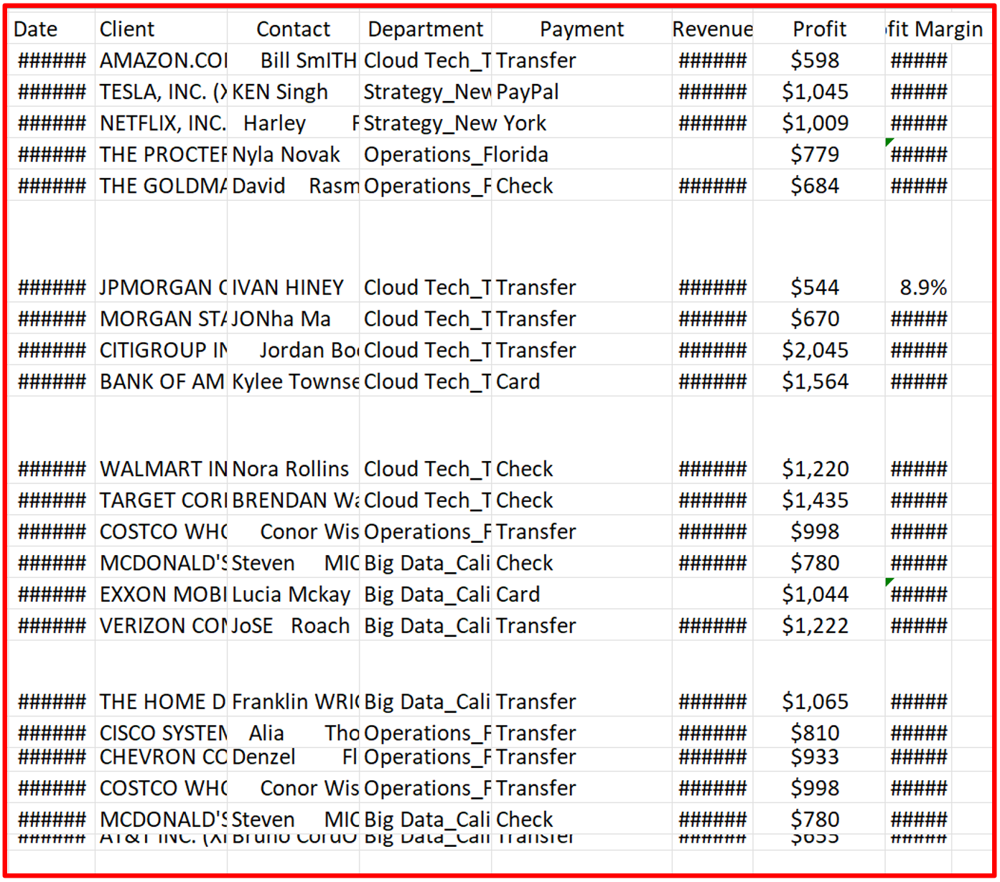
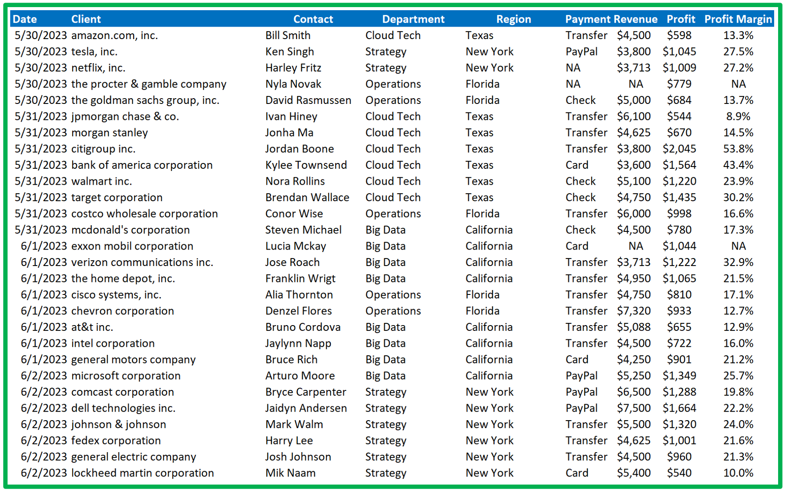

# Data Cleaning in MS Excel

When working with datasets in MS Excel, I understand that data cleaning is crucial to ensuring accuracy and consistency in data analysis. The dataset I worked with contains the following variables: `Date`, `Client`, `Contact`, `Department`, `Payment`, `Revenue`, `Profit`, and `Profit Margin`. In this project, I utilized various Excel features and shortcuts to perform a series of tasks, effectively cleaning and organizing the data.

## Table of Contents

- [Introduction](#introduction)
- [Key Steps in Data Cleaning](#key-steps-in-data-cleaning)
  1. [Fitting the Column and Row Widths](#1-fitting-the-column-and-row-widths)
  2. [Shortening Client Names](#2-shortening-client-names)
  3. [Lowercasing Client Names](#3-lowering-client-names)
  4. [Trimming Spaces and Correcting Capitalization in the Contact Column](#4-trimming-spaces-and-correcting-capitalization-in-the-contact-column)
  5. [Splitting the Department Column into Two Separate Columns](#5-splitting-the-department-column-into-two-separate-columns)
  6. [Removing Duplicate Values](#6-removing-duplicate-values)
  7. [Replacing Blank Cells with "NA"](#7-replacing-blank-cells-with-na)
  8. [Fixing Calculation Errors](#8-fixing-calculation-errors)
  9. [Formatting the Header](#9-formatting-the-header)
  10. [Removing Gridlines](#10-removing-gridlines)
- [Dataset Snapshots](#dataset-snapshots)
- [Conclusion](#conclusion)
- [How to Use This Repository](#how-to-use-this-repository)
- [Contact](#contact)

## Introduction

I have always been passionate about data-driven insights and problem-solving. In this project, I cleaned and organized a dataset using MS Excel to ensure that the data was accurate, consistent, and ready for analysis.

## Key Steps in Data Cleaning

### 1. Fitting the Column and Row Widths

To make the dataset visually appealing and ensure all data is visible, I started by adjusting the column and row widths:

- **Autofit Column Width**: I pressed `Ctrl + A` to select the entire worksheet, then `Alt + H + O + I` to autofit the column width.
- **Autofit Row Width**: Similarly, I pressed `Alt + H + O + A` to autofit the row width.

### 2. Shortening Client Names

In the dataset, client names included additional information enclosed in parentheses. I streamlined the data by removing these parentheses and the text within them:

- I pressed `Ctrl + H` to bring up the Find and Replace dialog box.
- In the "Find what" field, I entered `(*)` to search for any text within parentheses.
- I left the "Replace with" field blank and clicked "Replace All."

### 3. Lowercasing Client Names

Consistency in data entry is vital, especially when working with text data. I converted the client names to lowercase:

- I selected the next column, pressed `Ctrl + Shift + Plus` to insert a new column, and named it "Client."
- In the first cell of the new column, I entered `=LOWER(C3)` (with `C3` being the cell reference) and pressed Enter.
- I dragged the formula down to apply it to all rows, copied the data, pasted it as values, and deleted the original "Client" column.

### 4. Trimming Spaces and Correcting Capitalization in the Contact Column

The Contact column had inconsistent spacing and capitalization. I fixed this using Excel functions:

- I inserted a new column and named it "Contact."
- In the first cell of the new column, I entered `=PROPER(TRIM(E3))` (with `E3` being the cell reference) and pressed Enter.
- I dragged the formula down, copied the cleaned data, pasted it as values, and then deleted the original "Contact" column.

### 5. Splitting the Department Column into Two Separate Columns

The Department column contained both department names and regions. I split these into two separate columns:

- I inserted a new column to the right of the Department column.
- I selected the rows under the Department header, went to the Data tab, and selected the "Text to Columns" tool.
- I chose the "Delimited" option, selected the underscore (`_`) as the delimiter, and set the destination.
- The Department column was then split into two separate columns: one for the department name and another for the region.

### 6. Removing Duplicate Values

Duplicate entries can skew the analysis, so I removed them:

- I pressed `Ctrl + A` to select the entire table.
- Under the Data tab, I selected "Remove Duplicates." I ensured that all columns were selected and checked the "My data has headers" option, then clicked "OK."
- I removed 11 duplicate values, leaving 30 unique values.

### 7. Replacing Blank Cells with "NA"

Blank cells can cause issues in calculations and data analysis, so I replaced them with "NA":

- I pressed `Ctrl + A` to select the entire table.
- Under the Home tab, I selected "Find & Select," then "Go to Special," and chose "Blanks."
- In the formula bar, I typed "NA" and pressed `Ctrl + Enter` to fill all selected blank cells.

### 8. Fixing Calculation Errors

The profit margin calculation showed errors due to missing values in the Revenue column. I fixed this using the IFERROR function:

- Normally, profit margin is calculated as `Profit / Revenue`.
- I modified the formula to `=IFERROR(Profit/Revenue, "NA")` to replace errors with "NA" where applicable.

### 9. Formatting the Header

A well-formatted header makes the dataset easier to navigate and understand:

- I selected all headers by pressing `Ctrl + Shift + >`.
- I pressed `Ctrl + B` to make the headers bold and customized the font and highlight color as desired.

### 10. Removing Gridlines

Finally, I removed gridlines to improve the visual presentation of the data:

- I pressed `Alt + W + V + G` to hide the gridlines.

## Dataset Snapshots

- **Before Cleaning**: 
- **After Cleaning**: 

## Conclusion

By following these steps, I ensured that the dataset is clean, organized, and ready for analysis. Data cleaning is a critical process that maintains the integrity of the data and enhances the accuracy of the insights and findings derived from it.

